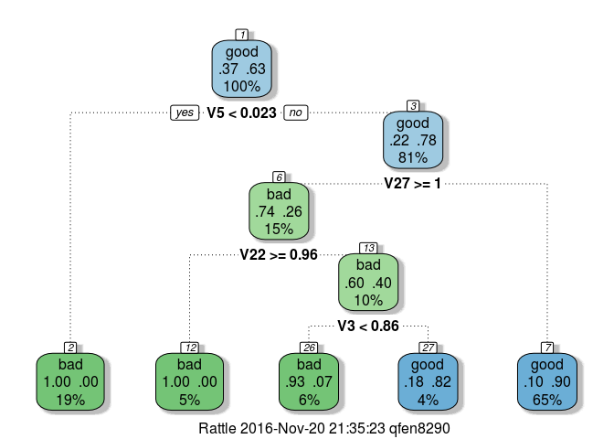

Calssification in R
================

Introduction
============

Machine learning is all about building models to learn from data and then to predict unseen data.

Classification is the most widely used machine learning technique. The basic idea is to build a classifier which learns from training observations with discrete classes and then is applied to predict the outcome for new observations. There most common example we have seen everyday is probably the spam or junk mail filter in the email system which is telling you whether the email is a junk mail or not.

### Load the libraries

``` r
library(mlbench)              # datasets
library(class)                # knn
library(caret)
```

    ## Loading required package: lattice

    ## Loading required package: ggplot2

``` r
library(e1071)
library(MASS)                 # lda
```

### Load the dataset

``` r
data("Ionosphere")
str(Ionosphere)
```

    ## 'data.frame':    351 obs. of  35 variables:
    ##  $ V1   : Factor w/ 2 levels "0","1": 2 2 2 2 2 2 2 1 2 2 ...
    ##  $ V2   : Factor w/ 1 level "0": 1 1 1 1 1 1 1 1 1 1 ...
    ##  $ V3   : num  0.995 1 1 1 1 ...
    ##  $ V4   : num  -0.0589 -0.1883 -0.0336 -0.4516 -0.024 ...
    ##  $ V5   : num  0.852 0.93 1 1 0.941 ...
    ##  $ V6   : num  0.02306 -0.36156 0.00485 1 0.06531 ...
    ##  $ V7   : num  0.834 -0.109 1 0.712 0.921 ...
    ##  $ V8   : num  -0.377 -0.936 -0.121 -1 -0.233 ...
    ##  $ V9   : num  1 1 0.89 0 0.772 ...
    ##  $ V10  : num  0.0376 -0.0455 0.012 0 -0.164 ...
    ##  $ V11  : num  0.852 0.509 0.731 0 0.528 ...
    ##  $ V12  : num  -0.1776 -0.6774 0.0535 0 -0.2028 ...
    ##  $ V13  : num  0.598 0.344 0.854 0 0.564 ...
    ##  $ V14  : num  -0.44945 -0.69707 0.00827 0 -0.00712 ...
    ##  $ V15  : num  0.605 -0.517 0.546 -1 0.344 ...
    ##  $ V16  : num  -0.38223 -0.97515 0.00299 0.14516 -0.27457 ...
    ##  $ V17  : num  0.844 0.055 0.838 0.541 0.529 ...
    ##  $ V18  : num  -0.385 -0.622 -0.136 -0.393 -0.218 ...
    ##  $ V19  : num  0.582 0.331 0.755 -1 0.451 ...
    ##  $ V20  : num  -0.3219 -1 -0.0854 -0.5447 -0.1781 ...
    ##  $ V21  : num  0.5697 -0.1315 0.7089 -0.6997 0.0598 ...
    ##  $ V22  : num  -0.297 -0.453 -0.275 1 -0.356 ...
    ##  $ V23  : num  0.3695 -0.1806 0.4339 0 0.0231 ...
    ##  $ V24  : num  -0.474 -0.357 -0.121 0 -0.529 ...
    ##  $ V25  : num  0.5681 -0.2033 0.5753 1 0.0329 ...
    ##  $ V26  : num  -0.512 -0.266 -0.402 0.907 -0.652 ...
    ##  $ V27  : num  0.411 -0.205 0.59 0.516 0.133 ...
    ##  $ V28  : num  -0.462 -0.184 -0.221 1 -0.532 ...
    ##  $ V29  : num  0.2127 -0.1904 0.431 1 0.0243 ...
    ##  $ V30  : num  -0.341 -0.116 -0.174 -0.201 -0.622 ...
    ##  $ V31  : num  0.4227 -0.1663 0.6044 0.2568 -0.0571 ...
    ##  $ V32  : num  -0.5449 -0.0629 -0.2418 1 -0.5957 ...
    ##  $ V33  : num  0.1864 -0.1374 0.5605 -0.3238 -0.0461 ...
    ##  $ V34  : num  -0.453 -0.0245 -0.3824 1 -0.657 ...
    ##  $ Class: Factor w/ 2 levels "bad","good": 2 1 2 1 2 1 2 1 2 1 ...

``` r
summary(Ionosphere)
```

    ##  V1      V2            V3                V4                 V5         
    ##  0: 38   0:351   Min.   :-1.0000   Min.   :-1.00000   Min.   :-1.0000  
    ##  1:313           1st Qu.: 0.4721   1st Qu.:-0.06474   1st Qu.: 0.4127  
    ##                  Median : 0.8711   Median : 0.01631   Median : 0.8092  
    ##                  Mean   : 0.6413   Mean   : 0.04437   Mean   : 0.6011  
    ##                  3rd Qu.: 1.0000   3rd Qu.: 0.19418   3rd Qu.: 1.0000  
    ##                  Max.   : 1.0000   Max.   : 1.00000   Max.   : 1.0000  
    ##        V6                V7                V8                 V9          
    ##  Min.   :-1.0000   Min.   :-1.0000   Min.   :-1.00000   Min.   :-1.00000  
    ##  1st Qu.:-0.0248   1st Qu.: 0.2113   1st Qu.:-0.05484   1st Qu.: 0.08711  
    ##  Median : 0.0228   Median : 0.7287   Median : 0.01471   Median : 0.68421  
    ##  Mean   : 0.1159   Mean   : 0.5501   Mean   : 0.11936   Mean   : 0.51185  
    ##  3rd Qu.: 0.3347   3rd Qu.: 0.9692   3rd Qu.: 0.44567   3rd Qu.: 0.95324  
    ##  Max.   : 1.0000   Max.   : 1.0000   Max.   : 1.00000   Max.   : 1.00000  
    ##       V10                V11                V12          
    ##  Min.   :-1.00000   Min.   :-1.00000   Min.   :-1.00000  
    ##  1st Qu.:-0.04807   1st Qu.: 0.02112   1st Qu.:-0.06527  
    ##  Median : 0.01829   Median : 0.66798   Median : 0.02825  
    ##  Mean   : 0.18135   Mean   : 0.47618   Mean   : 0.15504  
    ##  3rd Qu.: 0.53419   3rd Qu.: 0.95790   3rd Qu.: 0.48237  
    ##  Max.   : 1.00000   Max.   : 1.00000   Max.   : 1.00000  
    ##       V13               V14                V15               V16          
    ##  Min.   :-1.0000   Min.   :-1.00000   Min.   :-1.0000   Min.   :-1.00000  
    ##  1st Qu.: 0.0000   1st Qu.:-0.07372   1st Qu.: 0.0000   1st Qu.:-0.08170  
    ##  Median : 0.6441   Median : 0.03027   Median : 0.6019   Median : 0.00000  
    ##  Mean   : 0.4008   Mean   : 0.09341   Mean   : 0.3442   Mean   : 0.07113  
    ##  3rd Qu.: 0.9555   3rd Qu.: 0.37486   3rd Qu.: 0.9193   3rd Qu.: 0.30897  
    ##  Max.   : 1.0000   Max.   : 1.00000   Max.   : 1.0000   Max.   : 1.00000  
    ##       V17               V18                 V19         
    ##  Min.   :-1.0000   Min.   :-1.000000   Min.   :-1.0000  
    ##  1st Qu.: 0.0000   1st Qu.:-0.225690   1st Qu.: 0.0000  
    ##  Median : 0.5909   Median : 0.000000   Median : 0.5762  
    ##  Mean   : 0.3819   Mean   :-0.003617   Mean   : 0.3594  
    ##  3rd Qu.: 0.9357   3rd Qu.: 0.195285   3rd Qu.: 0.8993  
    ##  Max.   : 1.0000   Max.   : 1.000000   Max.   : 1.0000  
    ##       V20                V21               V22           
    ##  Min.   :-1.00000   Min.   :-1.0000   Min.   :-1.000000  
    ##  1st Qu.:-0.23467   1st Qu.: 0.0000   1st Qu.:-0.243870  
    ##  Median : 0.00000   Median : 0.4991   Median : 0.000000  
    ##  Mean   :-0.02402   Mean   : 0.3367   Mean   : 0.008296  
    ##  3rd Qu.: 0.13437   3rd Qu.: 0.8949   3rd Qu.: 0.188760  
    ##  Max.   : 1.00000   Max.   : 1.0000   Max.   : 1.000000  
    ##       V23               V24                V25               V26          
    ##  Min.   :-1.0000   Min.   :-1.00000   Min.   :-1.0000   Min.   :-1.00000  
    ##  1st Qu.: 0.0000   1st Qu.:-0.36689   1st Qu.: 0.0000   1st Qu.:-0.33239  
    ##  Median : 0.5318   Median : 0.00000   Median : 0.5539   Median :-0.01505  
    ##  Mean   : 0.3625   Mean   :-0.05741   Mean   : 0.3961   Mean   :-0.07119  
    ##  3rd Qu.: 0.9112   3rd Qu.: 0.16463   3rd Qu.: 0.9052   3rd Qu.: 0.15676  
    ##  Max.   : 1.0000   Max.   : 1.00000   Max.   : 1.0000   Max.   : 1.00000  
    ##       V27               V28                V29               V30          
    ##  Min.   :-1.0000   Min.   :-1.00000   Min.   :-1.0000   Min.   :-1.00000  
    ##  1st Qu.: 0.2864   1st Qu.:-0.44316   1st Qu.: 0.0000   1st Qu.:-0.23689  
    ##  Median : 0.7082   Median :-0.01769   Median : 0.4966   Median : 0.00000  
    ##  Mean   : 0.5416   Mean   :-0.06954   Mean   : 0.3784   Mean   :-0.02791  
    ##  3rd Qu.: 0.9999   3rd Qu.: 0.15354   3rd Qu.: 0.8835   3rd Qu.: 0.15407  
    ##  Max.   : 1.0000   Max.   : 1.00000   Max.   : 1.0000   Max.   : 1.00000  
    ##       V31               V32                 V33         
    ##  Min.   :-1.0000   Min.   :-1.000000   Min.   :-1.0000  
    ##  1st Qu.: 0.0000   1st Qu.:-0.242595   1st Qu.: 0.0000  
    ##  Median : 0.4428   Median : 0.000000   Median : 0.4096  
    ##  Mean   : 0.3525   Mean   :-0.003794   Mean   : 0.3494  
    ##  3rd Qu.: 0.8576   3rd Qu.: 0.200120   3rd Qu.: 0.8138  
    ##  Max.   : 1.0000   Max.   : 1.000000   Max.   : 1.0000  
    ##       V34            Class    
    ##  Min.   :-1.00000   bad :126  
    ##  1st Qu.:-0.16535   good:225  
    ##  Median : 0.00000             
    ##  Mean   : 0.01448             
    ##  3rd Qu.: 0.17166             
    ##  Max.   : 1.00000

Training and test set split
---------------------------

It is important to shuffle the samples before the split. Generally we can split training and test set into 7/3.

``` r
set.seed(1)
df <- Ionosphere[, -c(1, 2)]
ix_shuffled <- sample(1:nrow(df), size=nrow(df), replace=F)
ix_train <- ix_shuffled[1:round(0.7 * nrow(df))]
df_train <- df[ix_train, ]
df_test <- df[-ix_train, ]
```

Alternatively, we can utilize the createDataPartition function from caret library.

``` r
ixTrain <- createDataPartition(df$Class, p=0.7)
```

SVM (Support Vector Machines) model
-----------------------------------

The basic idea of SVM model is to find the hyperplane that can seperate the classes in the feature space while maximizing the margain (or gap) between classes. If the feature space can't be separated by linear boundary, we can enlarge the feature space through kernel tricks (namely polynomial kernel, radial kernel, etc.) to make it linear separable. SVM model is implemented in the library e1071.

``` r
library(e1071)
```

### SVM model with linear kernel

``` r
svm_model1 <- svm(Class ~ ., data=df_train, kernel="linear", type="C-classification")
svm_pred1 <- predict(svm_model1, df_test)
```

### Model performance metrics

We define a function to obtain various performance metrics for the classification model

``` r
classification_metrics <- function(truth, pred, pos_label=NULL) {
  if (length(unique(truth)) == 2 & is.null(pos_label)) {
    stop("pos_label must not NULL")
  }
  else if (length(unique(truth)) == 2) {
    conf <- table(truth, pred)
    acc <- sum(diag(conf)) / sum(conf)
    pos_ix <- which(colnames(conf) == pos_label)
    TP <- conf[pos_ix, pos_ix]
    TN <- conf[-pos_ix, -pos_ix]
    FP <- conf[-pos_ix, pos_ix]
    FN <- conf[pos_ix, -pos_ix]
    precision <- TP / (TP + FP)
    recall <- TP / (TP + FN)
    F1_score <- 2*TP / (2*TP + FP + FN)
    metrics <- list(accuracy=acc, precision=precision, recall=recall, F1_score=F1_score, TP=TP, TN=TN, FP=FP, FN=FN)
  }
}
```

``` r
svm_metrics1 <- classification_metrics(df_test$Class, svm_pred1, pos_label="good")
cat(c("Accuracy:", round(svm_metrics1$accuracy, digits = 3)))
```

    ## Accuracy: 0.857

``` r
cat(c("Precision:", round(svm_metrics1$precision, digits = 3)))
```

    ## Precision: 0.84

``` r
cat(c("Recall:", round(svm_metrics1$recall, digits = 3)))
```

    ## Recall: 0.971

``` r
cat(c("F1 score:", round(svm_metrics1$F1_score, digits = 3)))
```

    ## F1 score: 0.901

### SVM model with polynomial kernel

``` r
svm_model2 <- svm(Class ~ ., data=df_train, kernel="polynomial", type="C-classification")
svm_pred2 <- predict(svm_model2, df_test)
```

### Model performance metrics

``` r
svm_metrics2 <- classification_metrics(df_test$Class, svm_pred2, pos_label="good")
cat(c("Accuracy:", round(svm_metrics2$accuracy, digits = 3)))
```

    ## Accuracy: 0.743

``` r
cat(c("Precision:", round(svm_metrics2$precision, digits = 3)))
```

    ## Precision: 0.722

``` r
cat(c("Recall:", round(svm_metrics2$recall, digits = 3)))
```

    ## Recall: 1

``` r
cat(c("F1 score:", round(svm_metrics2$F1_score, digits = 3)))
```

    ## F1 score: 0.838

### SVM model with RBF kernel

``` r
svm_model3 <- svm(Class ~ ., data=df_train, kernel="radial", type="C-classification")
svm_pred3 <- predict(svm_model3, df_test)
```

### Model performance metrics

``` r
svm_metrics3 <- classification_metrics(df_test$Class, svm_pred3, pos_label="good")
cat(c("Accuracy:", round(svm_metrics3$accuracy, digits = 3)))
```

    ## Accuracy: 0.962

``` r
cat(c("Precision:", round(svm_metrics3$precision, digits = 3)))
```

    ## Precision: 0.946

``` r
cat(c("Recall:", round(svm_metrics3$recall, digits = 3)))
```

    ## Recall: 1

``` r
cat(c("F1 score:", round(svm_metrics3$F1_score, digits = 3)))
```

    ## F1 score: 0.972

kNN (k-Nearest Neighbours) model
--------------------------------

kNN is an instance-based learning method, also knows as non-parametric lazy learning algorithm. It is because unlike most of the algorithms which are required to learn the weights (parameters) of the model during training process, kNN just stores the training samples and make prediction for unseen data by comparing them to the training set with a given distance metric.

``` r
knn_pred1 <- knn(train=df_train[, -33], test=df_test[, -33], cl=df_train$Class, k=3)
```

### Model performance metrics

``` r
knn_metrics1 <- classification_metrics(df_test$Class, knn_pred1, pos_label="good")
cat(c("Accuracy:", round(knn_metrics1$accuracy, digits = 3)))
```

    ## Accuracy: 0.886

``` r
cat(c("Precision:", round(knn_metrics1$precision, digits = 3)))
```

    ## Precision: 0.872

``` r
cat(c("Recall:", round(knn_metrics1$recall, digits = 3)))
```

    ## Recall: 0.971

``` r
cat(c("F1 score:", round(knn_metrics1$F1_score, digits = 3)))
```

    ## F1 score: 0.919

Logistic Regression model
-------------------------

``` r
lr_model1 <- glm(Class ~ ., data=df_train, family=binomial(link="logit"))
summary(lr_model1)
```

    ## 
    ## Call:
    ## glm(formula = Class ~ ., family = binomial(link = "logit"), data = df_train)
    ## 
    ## Deviance Residuals: 
    ##      Min        1Q    Median        3Q       Max  
    ## -2.44678  -0.02458   0.14227   0.25056   3.09964  
    ## 
    ## Coefficients:
    ##             Estimate Std. Error z value Pr(>|z|)    
    ## (Intercept) -3.02337    0.85653  -3.530 0.000416 ***
    ## V3           3.03546    1.37387   2.209 0.027145 *  
    ## V4           0.70425    1.28285   0.549 0.583023    
    ## V5           4.65601    1.59434   2.920 0.003497 ** 
    ## V6           1.02496    1.17410   0.873 0.382676    
    ## V7          -0.67795    1.60597  -0.422 0.672921    
    ## V8           2.92335    1.22464   2.387 0.016981 *  
    ## V9           2.91493    1.76762   1.649 0.099133 .  
    ## V10          0.07374    1.16056   0.064 0.949339    
    ## V11         -2.92214    1.32980  -2.197 0.027990 *  
    ## V12         -1.83268    1.30877  -1.400 0.161423    
    ## V13         -3.58975    1.51941  -2.363 0.018147 *  
    ## V14          2.71281    0.93341   2.906 0.003657 ** 
    ## V15          4.22571    1.51093   2.797 0.005162 ** 
    ## V16         -1.69769    1.15148  -1.474 0.140385    
    ## V17          2.66534    1.16527   2.287 0.022177 *  
    ## V18          0.43937    0.95543   0.460 0.645613    
    ## V19         -1.00682    1.79602  -0.561 0.575083    
    ## V20         -0.39761    1.50112  -0.265 0.791105    
    ## V21         -1.08367    1.72683  -0.628 0.530301    
    ## V22         -5.17264    1.31617  -3.930 8.49e-05 ***
    ## V23          1.99893    1.47628   1.354 0.175724    
    ## V24          1.62921    0.92942   1.753 0.079614 .  
    ## V25         -1.39626    1.29919  -1.075 0.282500    
    ## V26          2.62525    1.00923   2.601 0.009289 ** 
    ## V27         -7.25542    1.69042  -4.292 1.77e-05 ***
    ## V28         -0.07145    1.30871  -0.055 0.956463    
    ## V29          4.68488    1.58583   2.954 0.003135 ** 
    ## V30          0.83496    1.05992   0.788 0.430838    
    ## V31          1.38358    1.06479   1.299 0.193808    
    ## V32         -0.17269    1.38430  -0.125 0.900721    
    ## V33         -0.26260    1.49786  -0.175 0.860829    
    ## V34         -1.07487    0.98661  -1.089 0.275949    
    ## ---
    ## Signif. codes:  0 '***' 0.001 '**' 0.01 '*' 0.05 '.' 0.1 ' ' 1
    ## 
    ## (Dispersion parameter for binomial family taken to be 1)
    ## 
    ##     Null deviance: 324.18  on 245  degrees of freedom
    ## Residual deviance: 105.21  on 213  degrees of freedom
    ## AIC: 171.21
    ## 
    ## Number of Fisher Scoring iterations: 8

``` r
lr_pred1 <- predict(lr_model1, df_test, type="response")
lr_pred1 <- ifelse(lr_pred1 > 0.5, "good", "bad")
```

### Model performance metrics

``` r
lr_metrics1 <- classification_metrics(df_test$Class, lr_pred1, pos_label="good")
cat(c("Accuracy:", round(lr_metrics1$accuracy, digits = 3)))
```

    ## Accuracy: 0.857

``` r
cat(c("Precision:", round(lr_metrics1$precision, digits = 3)))
```

    ## Precision: 0.857

``` r
cat(c("Recall:", round(lr_metrics1$recall, digits = 3)))
```

    ## Recall: 0.943

``` r
cat(c("F1 score:", round(lr_metrics1$F1_score, digits = 3)))
```

    ## F1 score: 0.898

LDA (Linear Discriminant Analysis) model
----------------------------------------

``` r
lda_model1 <- lda(Class ~ ., data=df_train)
lda_pred1 <- predict(lda_model1, df_test, type="response")$class
```

### Model performance metrics

``` r
lda_metrics1 <- classification_metrics(df_test$Class, lda_pred1, pos_label="good")
cat(c("Accuracy:", round(lda_metrics1$accuracy, digits = 3)))
```

    ## Accuracy: 0.876

``` r
cat(c("Precision:", round(lda_metrics1$precision, digits = 3)))
```

    ## Precision: 0.843

``` r
cat(c("Recall:", round(lda_metrics1$recall, digits = 3)))
```

    ## Recall: 1

``` r
cat(c("F1 score:", round(lda_metrics1$F1_score, digits = 3)))
```

    ## F1 score: 0.915

Decision Tree model
-------------------

``` r
library(rpart)
library(rattle)
```

    ## Rattle: A free graphical interface for data mining with R.
    ## Version 5.0.2 Copyright (c) 2006-2016 Togaware Pty Ltd.
    ## Type 'rattle()' to shake, rattle, and roll your data.

``` r
library(RColorBrewer)

dt_model1 <- rpart(Class ~ ., data=df_train)
fancyRpartPlot(dt_model1)
```



``` r
dt_pred1 <- predict(dt_model1, df_test, type="class")
```

### Model performance metrics

``` r
dt_metrics1 <- classification_metrics(df_test$Class, dt_pred1, pos_label="good")
cat(c("Accuracy:", round(dt_metrics1$accuracy, digits = 3)))
```

    ## Accuracy: 0.924

``` r
cat(c("Precision:", round(dt_metrics1$precision, digits = 3)))
```

    ## Precision: 0.897

``` r
cat(c("Recall:", round(dt_metrics1$recall, digits = 3)))
```

    ## Recall: 1

``` r
cat(c("F1 score:", round(dt_metrics1$F1_score, digits = 3)))
```

    ## F1 score: 0.946
